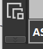
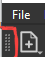

**ASTC OpenGL ES 3**  
4x4 - low quality  
8x8 - best mix  
16x16 - highest  

**name.hd.astc.pvr** - single resolution  
**name.astc.pvr** - same or lower res + full mip mapping  

UNorm linear - non pbr  
UNorm srgb(name_BC) - pbr  

-----------------------------  

**BC** - convert to TGA then in [PVRTexTool](https://developer.imaginationtech.com/solutions/) to astc srgb   
If you can't open BC then use Nvidia Texture Tools to convert it to TGA  

-----------------------------  

For **ANM/NM/MISC/RM/MASK**  use PvrTexTool channel editor   
if you can't find it then press invisible button   
or drag tool bar to top   

**With Alpha:**  
    Channels RGBA to A-A-A-G  

**Without Alpha(its content in RED):**  
    Channels RGBA to R-R-R-G  

**No Alpha at all:**  
    Channels RGBA to G-G-G-G

**CM:**  
  **Blitz method:**  
    A8: convert to A8 OpenGL  
    L8: convert to ASTC then G-G-G-G and A8 OpenGL  
  **ASTC method:**  
    A8: convert to ASTC
    L8: convert to ASTC then G-G-G-G  

  **DX11 A8/L8 to BC3 Unorm Linear:**  
    A8: convert to  BC3 Unorm Linear  
    L8: convert to  BC3 Unorm Linear then G-G-G-G   
  **BC3 to Android:**  
    convert it to A8 or ASTC  

-----------------------------

**How to make pc remodeling textures work on android always:**  
1.Textures of same type, except tracks, should be combined including UVs  
2.Give combined texture a name from vanilla blitz or it won't accept it  
**How to install mod without it:** pack it into APK without dvpl format

-----------------------------

Texture looks like chess plate(missing textures)? Probably name issue  
Very dark unlike pc? Check alpha  
