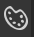

Astc OpenGL ES 3  
4x4 - low quality  
8x8 - best mix  
16x16 - highest  

name.hd.astc.pvr - single resolution  
name.astc.pvr - same(or lower if you want) res + full mip mapping  

linear - non pbr  
srgb(name_BC) - pbr  

-----------------------------  

BC - convert in Paint.Net or Nvidia Texture Tools to TGA then in PVRTexTool to astc srgb  
Astc to BC - ABGG  

-----------------------------  

PvrTexTool channel editor   
if you can't find it then press invisible button   
or drag tool bar to top   

ANM/NM/MISC/RM/MASK/CM  

With Alpha:  
Channels RGBA to A-A-A-G  

Without Alpha(its content in RED):  
Channels RGBA to R-R-R-G  

No Alpha at all:  
Channels RGBA to G-G-G-G

CM:  
Blitz method:  
A8: convert to A8 OpenGL  
L8: convert to ASTC then G-G-G-G and A8 OpenGL  
ASTC method:  
A8: just convert  
L8: astc then G-G-G-G  

-----------------------------

Note for remod makers: combine textures of same type into single one, with name of android file so android would accept it always  
How to install mod without it: pack it into APK without dvpl format

-----------------------------

Purple or green(pbr) squares(missing textures)? Probably name issue  
Very dark unlike pc? Check alpha  
